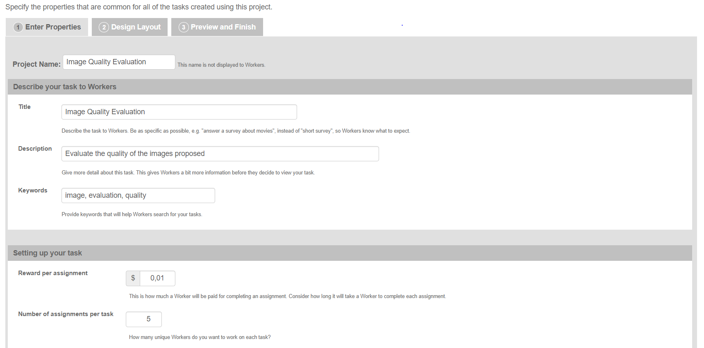
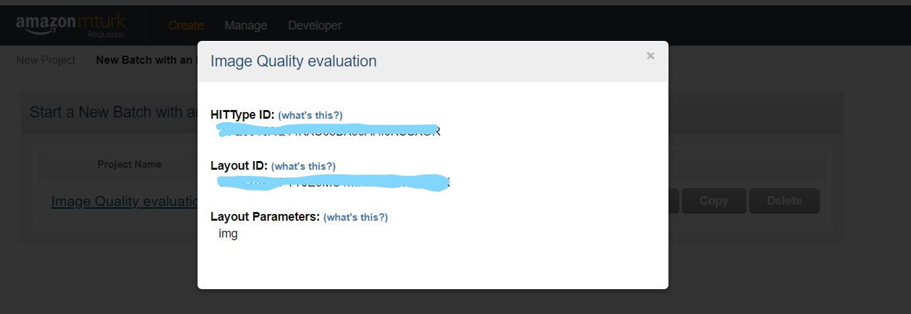
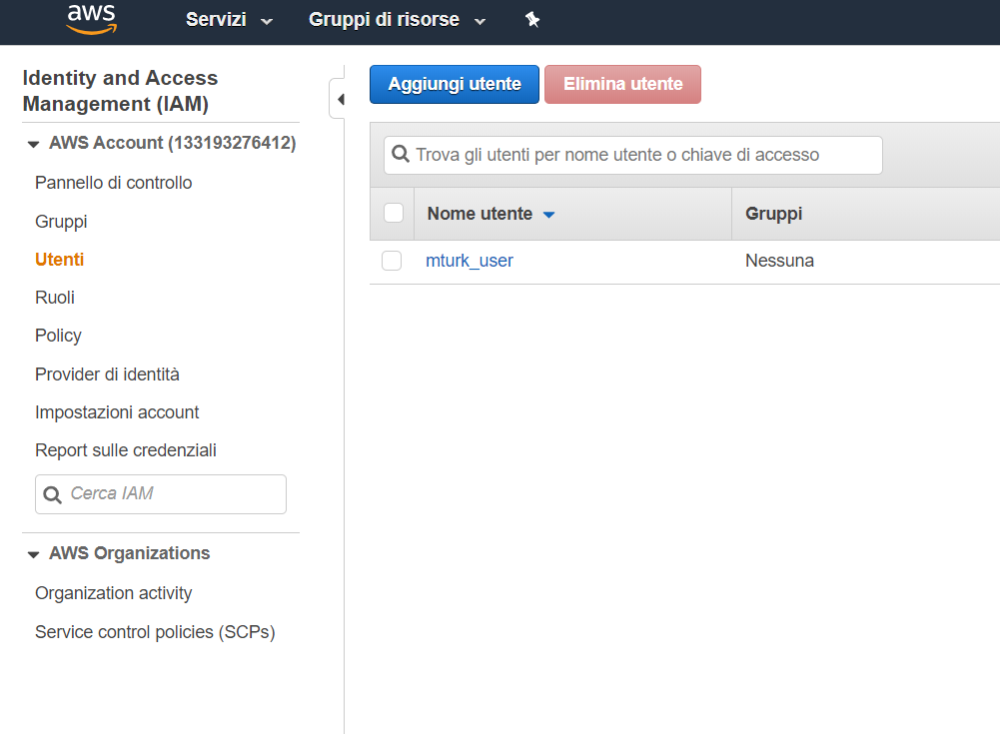
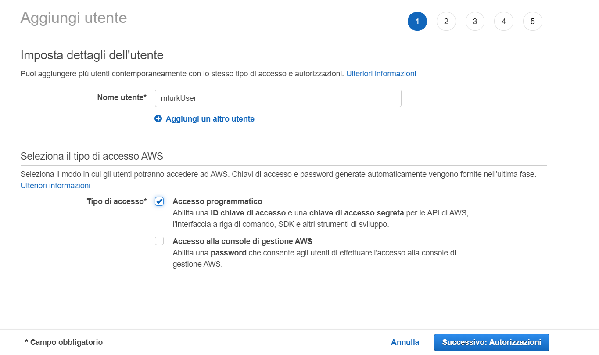
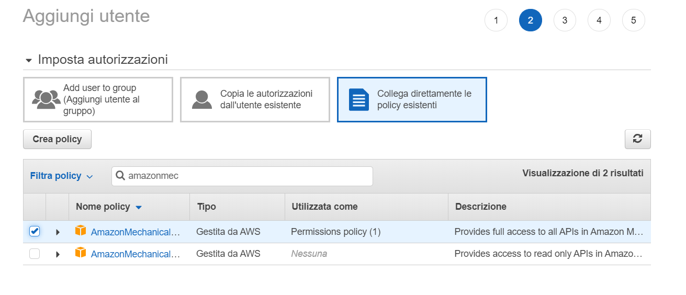
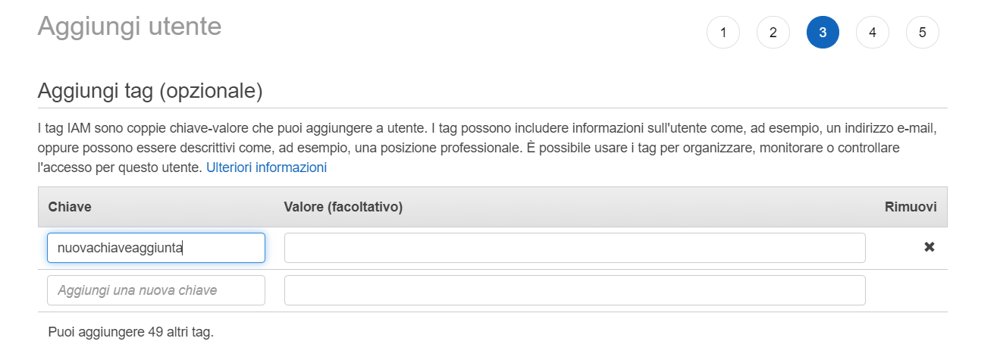
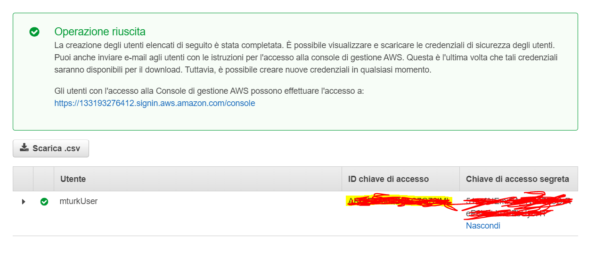
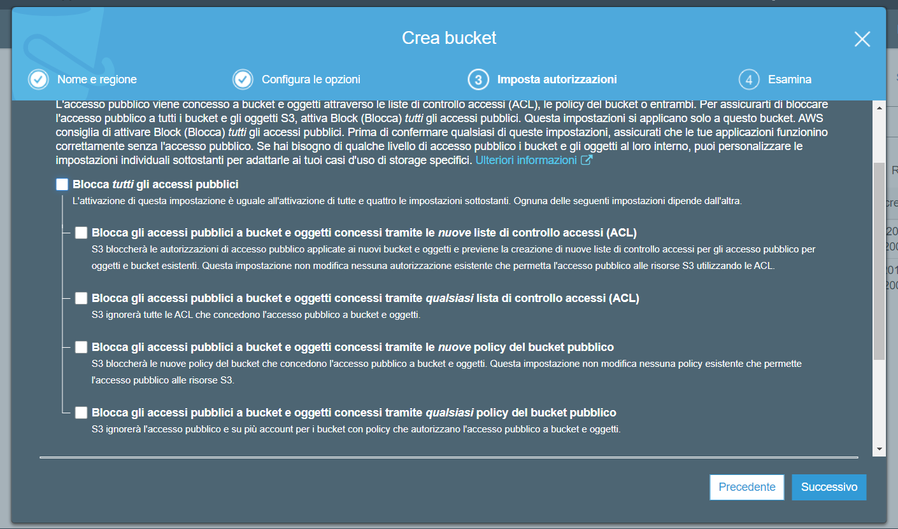

# MTurkTools
Tool che permette la creazione di hit tramite iterfaccia grafica, utilizza il framework Flask.

## SetUp MTurk:
1) Sign in as a Requester [here](https://www.mturk.com) and create Amazon account.
2) Create New Project [here](https://requester.mturk.com/create/projects/new) selectring Other type for the template.
3) Follow this image: 
4) Copy&Paste the content of layoutImages.html in DESIGN LAYOUT (pass 2 for the creation)
5) Save 
6) Copy HITTypeID and LayoutID from 
7) Paste  HITTypeID and LayoutID in [Key.py](https://github.com/edoardore/MTurkTools/blob/master/src/Key.py)

Repeat 2...7 with layoutVideo.html.

8) Create AWS account [here](https://aws.amazon.com/it/)
9) Now it's time to set up IAM console [here](https://console.aws.amazon.com/iam)
10) Follow this and click on ADD USER 
11) Enter text like:  and press Next button.
12) Select AmazonMechanicalTurkFullAccess like: 
13) Insert new key like: 
14) Select Next, and Create User
15) Copy the two key in  and paste it in [Key.py](https://github.com/edoardore/MTurkTools/blob/master/src/Key.py)

## SetUp Amazon S3:
1) Sign in [here](https://s3.console.aws.amazon.com/s3/home?region=eu-central-1#) with AWS userid and password created earlier.
2) Create two new bucket named: `imagesformturk` and `videosformturk` (in different times).
3) Deselect `Block all public access` here 
4) Press Create Bucket 
5) In `imagesformturk` open bucket -> go to authorization -> Policy Bucket and paste:
```{
    "Version": "2012-10-17",
    "Statement": [
        {
            "Sid": "PublicReadGetObject",
            "Effect": "Allow",
            "Principal": "*",
            "Action": "s3:GetObject",
            "Resource": "arn:aws:s3:::imagesformturk/*"
        }
    ]
}
```
6) In `videosformturk` open bucket -> go to authorization -> Policy Bucket and paste:
```
{
    "Version": "2012-10-17",
    "Statement": [
        {
            "Sid": "PublicReadGetObject",
            "Effect": "Allow",
            "Principal": "*",
            "Action": "s3:GetObject",
            "Resource": "arn:aws:s3:::videosformturk/*"
        }
    ]
}
```

Now it's all setted up! The tool can work correctly.

Use the requirement.txt to recreate the virtual env for the project.


### Views:
1) Benvenuto e possibilità di creare nuovo task.
2) Scelta di file da caricare su Amazon MTurk: video o immagini, possibilità di caricarne più di uno alla volta.
3) Schermata con tutti i task creati in precedenza di tipo immagine e video (separati)
4) È possibile fare il refresh dei risultati per scaricare le valutazioni di alcuni file dei task (viene mostrata percetuale di completamento del dask da parte dei Workers).
5) Dashboard disponibili per ogni task, ognuna di esse è personalizzata ed esegue queries solo su file del task selezionato.
6) Possibilità di creare numerosi task e di analizzarne i risultati dopo la sottomissione da parte dei Workers.

## Dashboard:
Si mostrano 11 (+1 modulare) grafici riferiti al task scelto:
1) Storia delle valutazioni per un singolo file (Immagine o Video). (Line graph)
2) Storia delle valutazioni effettuate da un singolo Worker (su Video o Immagini). (Line graph)
3) Confronto delle valutazioni effettuate da due Worker. (Radar graph)
4) Risultati ottenuti per un singolo file. (Pie graph)
5) Worker ordinati in base alle HIT effettuate e sottomesse. (Bar graph)
6) Worker che hanno sottomesso piu HIT e media dei valori della qualità inserita da essi. (Scatter graph)
7) Ordina i worker 'bugiardi' sulla base delle età e sesso differenti che hanno inserito nelle HIT. (Bar graph)
8) Mostra risultati di soli Workers maschi o femmine. (Pie graph)
9) Grafico con percentuale di risoluzione degli schermi dei Workers. (Bar graph)
10) Grafico con distribuzione di età dei Workers. (Bar graph)
11) Grafico che mostra la media e varianza della valutazione di ogni immagine del Task. (Line graph)
12) Visione di 3 grafici a scelta fra quelli precedenti in contemporanea. (Modular)

## License
[Edoardo Re](https://github.com/edoardore), 2019

[Chart.js](https://www.chartjs.org)
